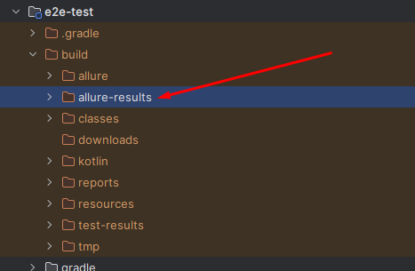
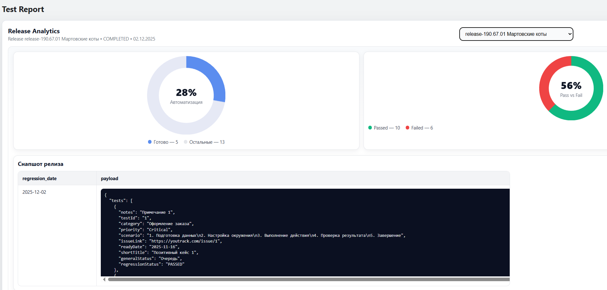

# Test Report System 🚀

## Что это за продукт

- **Назначение.** Система получения, хранения и отображения ручных и автоматизированных кейсов с историей запусков,
  снапшотами регрессов и наглядной статистикой.
- **Целевая аудитория.** Команды, у которых уже развёрнут привычный Allure Report, но нет возможности установить Allure
  TestOps.
- **Формат приложения.** Одностраничное SPA без профилирования, аутентификации и мульти-тенантности: предполагается
  отдельный инстанс на инфраструктуре каждой команды.
- **Компоненты.** Kotlin + Spring Boot backend с PostgreSQL и React SPA (Vite) фронтенд, упакованные вместе или
  разворачиваемые по отдельности.

## ✨ Основные возможности репортера

1. **Хранилище ручных тест кейсов, добавляемых вручную.** Добавляйте их прямо с главной страницы.
2. **Импорт из Allure-отчётов.** Загружайте результаты allure-results с главной страницы: система импортирует ID,
   название кейса, сценарий с вложениями и название фичи (категории). Укажите абсолютный путь до папки
allure-results

3. **Режим регрессионного тестирования с метриками.**
    - 🔴 Стартуйте регресс вручную по яркой кнопке и задавайте ему уникальное имя.
    - ✅ Проставляйте статусы прогонов для ручных кейсов прямо в интерфейсе.
    - 📥 Импортируйте свежие результаты автотестов через *allure-results* — в этом режиме автоматически подтягиваются
      статусы прогона каждого автотеста.
    - 🏁 Завершаете регресс, и сохранённые результаты попадают в БД и визуализируются в выпадающем виджете **Release
      Analytics** с инфографикой метрик.

👉 Ещё больше детальных сценариев и пользовательских историй — в файле [USER_SCENARIOS.md](./USER_SCENARIOS.md).

## Документация

Быстрый запуск:

1. Склонируйте репозиторий
2. Запустите из корня проекта docker compose up -d
3. Откройте в браузере http://localhost:18080/

 * Более подробные инструкции по локальному и контейнерному запуску вынесены в [DEPLOYMENT_GUIDE.md](./DEPLOYMENT_GUIDE.md).
 * Юз-кейсы и пользовательские сценарии собраны в [USER_SCENARIOS.md](./USER_SCENARIOS.md).
 * Логика работа парсера отчётов Allure содержится в [AllureParser.md](./AllureParser.md).

